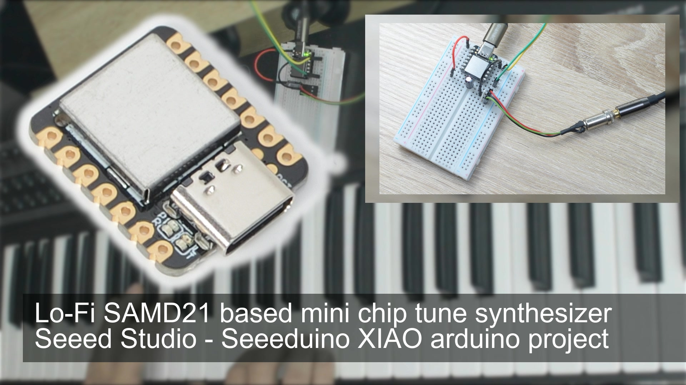

<h1 align="center">samd21_mini_synth</h1>
<h3 align="center">Lo-Fi SAMD21 based mini chip tune synthesizer Seeed Studio - Seeeduino XIAO arduino project</h3>  

 
   
  <a href="https://youtu.be/x4WEWTdZR90">link to the video</a>

<h2>Description</h2>
This time I went back to a very small controller: ATSAMD21G18A on a Seeeduino XIAO
The chip tune like polyphonic synthesizer is the result of my little experiment
It runs with "only" 48MHz without FPU and has one DAC (real analog output with 10 bit resolution)

Tested with arduino board 'seeed_XIAO_m0'

Some key features:
- 24 voices polyphony (more might be possible) / set to 12 for better performance
- Different selectable waveforms (sine, saw, square, pulse, tri)
- Separate setting per MIDI channel
- Short delay effect (250ms) with feedback control
- Pitchbend and modulation
- Modulation lfo waveforms: (sine, saw, square, pulse, tri, prn)
- Controllable intensity and speed of lfo

<h2>Connections</h2>
- RX pin for MIDI in (please use a dedicated circuit with an opto-coupler)
- DAC as audio out (requires a capacitor in series and an amplifier)

