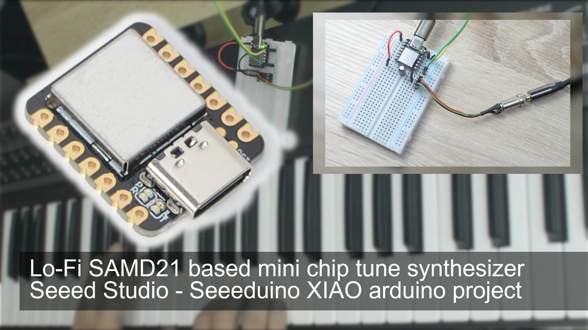

<h1 align="center">samd21_mini_synth</h1>
<h3 align="center">Lo-Fi SAMD21 based mini chip tune synthesizer Seeed Studio - Seeeduino XIAO arduino project</h3>  

 
   
  <a href="https://youtu.be/x4WEWTdZR90">link to the video</a>

<h2>Description</h2>
This time I went back to a very small controller: ATSAMD21G18A on a [Seeeduino XIAO aka Seeed Studio XIAO SAMD21](https://www.seeedstudio.com/Seeeduino-XIAO-Arduino-Microcontroller-SAMD21-Cortex-M0+-p-4426.html)
The chip tune like polyphonic synthesizer is the result of my little experiment
It runs with "only" 48MHz without FPU and has one DAC (real analog output with 10 bit resolution)

Tested with arduino board 'seeed_XIAO_m0'

Some key features:
- 24 voices polyphony (more might be possible) / set to 12 for better performance
- Different selectable waveforms (sine, saw, square, pulse, tri)
- Separate setting per MIDI channel
- Short delay effect (250ms) with feedback control
- Pitchbend and modulation
- Modulation lfo waveforms: (sine, saw, square, pulse, tri, prn)
- Controllable intensity and speed of lfo

<h2>Connections</h2>
- RX pin for MIDI in (please use a dedicated circuit with an opto-coupler)
- DAC as audio out (requires a capacitor in series and an amplifier)

<h2>Options</h2>
Please activate KEYB_USB_HOST_ENABLED in config.h to allow connecting an USB keyboard.
- the keyboard can be connected using an OTG USB adapter
- in addition to that you might need an external 5v power supply

## 🔧 Prebuilt Firmware

You can download ready-to-flash firmware without installing Arduino or building from source.

### 📥 Download

1. Go to the **Actions** tab of this repository.
2. Open the latest successful build.
3. Download the artifact for your board.
4. Extract the archive.
5. Use the `.uf2` file.

---

### 🚀 Flashing the Seeeduino XIAO

1. Connect the XIAO via USB.
2. Double-press the reset button. (short reset pin to ground with tweezers)
3. A USB drive named `Arduino` (or similar) will appear.
4. Drag & drop the `.uf2` file onto that drive.
5. The board will automatically reboot with the new firmware.

No Arduino IDE required.

---

### 📦 Available Files

The build artifacts contain:

* `.uf2` → Drag & drop firmware (recommended)
* `.bin` → Raw binary
* `.hex` → Intel HEX format
* `.elf` → Debug build with symbols
* `.map` → Linker memory map

---

### ⚠ Notes

* Always use firmware built for your specific board.
* If flashing fails, double-press reset again to re-enter bootloader mode.
